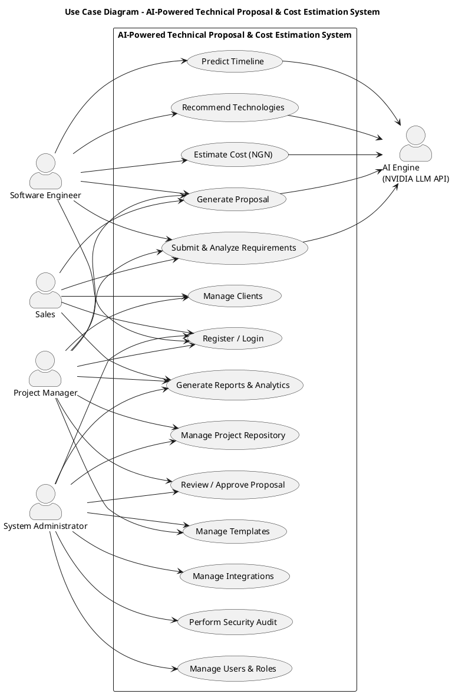
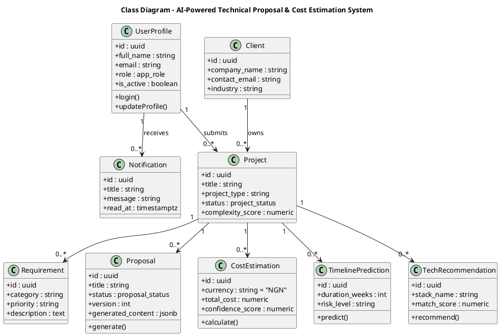
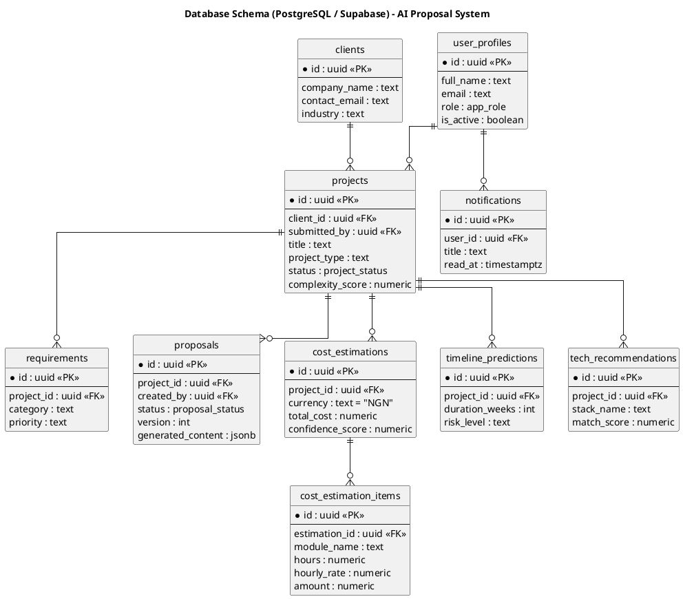
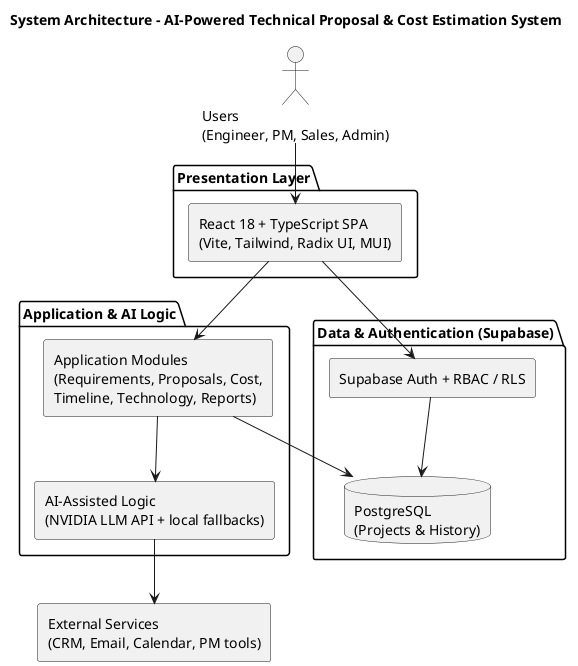
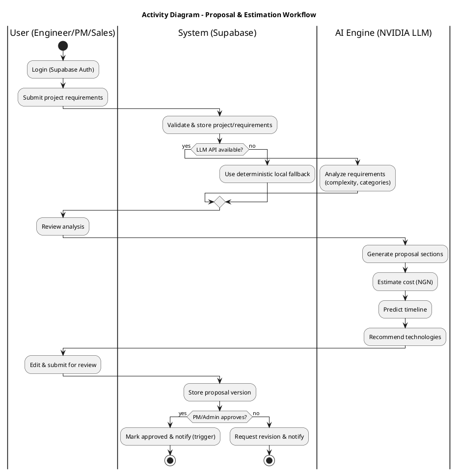
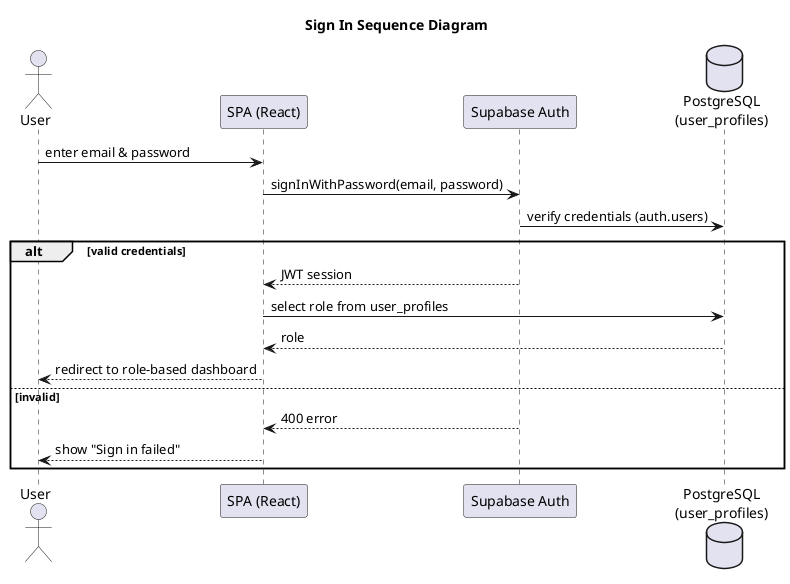

# UML Diagram Prompts & Corrected Sources

Prompts to (re)generate **every** UML diagram in the thesis so each one matches the implemented system. Each section has:
1. a **natural-language prompt** (paste into an AI/diagram generator), and
2. ready-to-render **PlantUML source**.

Ground truth used: roles = **engineer, project-manager, sales, admin** (no "Client" login); AI = **NVIDIA LLM API** (`meta/llama-3.3-70b-instruct`) with local fallbacks; database = **Supabase PostgreSQL** (uuid keys, enums, RLS); currency = **NGN (₦)**.

Render any block with:
```
java -jar plantuml.jar -tpng diagram.puml      # PNG
java -jar plantuml.jar -tsvg diagram.puml      # SVG (sharper for print)
```
The three **corrected** diagrams (Use Case, Class, ER) are rendered into `thesis/corrected_images/`.

---

## 1. Use Case Diagram (Figure 7) — **WRONG → regenerated**

**What was wrong:** actors were `Client / Software Engineer / System Administrator`. There is **no Client login role**, and **Project Manager and Sales were missing**.

**Prompt:**
> Create a UML use-case diagram for the "AI-Powered Technical Proposal & Cost Estimation System". Use exactly four human actors — **Software Engineer, Project Manager, Sales, System Administrator** — plus a system actor **AI Engine (NVIDIA LLM API)**. Do NOT include a "Client" actor (clients are data records, not users). Place all use cases inside a system boundary: Register/Login; Submit & Analyze Requirements; Generate Proposal; Estimate Cost (NGN); Predict Timeline; Recommend Technologies; Review/Approve Proposal; Manage Clients; Manage Project Repository; Generate Reports & Analytics; Manage Templates; Manage Integrations; Perform Security Audit; Manage Users & Roles. Connect actors by their real permissions: all four authenticate; Engineer/PM/Sales submit requirements & generate proposals; Engineer runs cost/timeline/technology; PM & Admin review proposals, manage repository & templates; PM/Sales manage clients & reports; Admin manages integrations, security audit, and users. The AI Engine performs the analysis/generation/estimation/recommendation use cases.



---

## 2. Class Diagram (Figure 13) — **regenerated (accurate attributes)**

**What was off:** attributes typed as `Integer` (real PKs are `uuid`); included a `Client` entity that is fine, but field names drifted.

**Prompt:**
> Create a UML class diagram for the system's domain model. Use these classes with `uuid` identifiers and the real attributes: UserProfile(id, full_name, email, role:app_role, is_active), Client(id, company_name, contact_email, industry), Project(id, title, project_type, status:project_status, complexity_score), Requirement(id, category, priority, description), Proposal(id, title, status:proposal_status, version, generated_content:jsonb), CostEstimation(id, currency=NGN, total_cost, confidence_score), TimelinePrediction(id, duration_weeks, risk_level), TechRecommendation(id, stack_name, match_score), Notification(id, title, message, read_at). Relationships: a Client owns many Projects; a UserProfile submits many Projects and receives many Notifications; a Project has many Requirements, Proposals, CostEstimations, TimelinePredictions, and TechRecommendations.



---

## 3. Database / ER Diagram (Figure 22) — **regenerated (PostgreSQL)**

**What was off:** `client_name`→`company_name`, `generated_by`→`created_by`, "Users"→`user_profiles`; types should be PostgreSQL.

**Prompt:**
> Create an entity-relationship diagram for the Supabase PostgreSQL schema. Show tables `user_profiles`, `clients`, `projects`, `requirements`, `proposals`, `cost_estimations`, `cost_estimation_items`, `timeline_predictions`, `tech_recommendations`, `notifications` with `uuid` primary keys and the correct foreign keys (projects→clients & user_profiles; requirements/proposals/cost_estimations/timeline_predictions/tech_recommendations→projects; cost_estimation_items→cost_estimations; notifications→user_profiles). Use crow's-foot one-to-many notation.



---

## 4. System Architecture (Figure 23) — already correct; prompt for reference

**Prompt:**
> Create a layered architecture diagram. Box 1 (Users): Engineer, PM, Sales, Admin. Box 2 (Presentation): React 18 + TypeScript SPA — Vite, Tailwind CSS, Radix UI, MUI. Box 3 (Application Modules): Requirements, Proposals, Cost, Timeline, Technology, Reports. Box 4 (AI-Assisted Logic Layer): NVIDIA LLM API for analysis, generation, estimation, recommendation (with local fallbacks). Box 5 (Data/Auth): Supabase Auth + RBAC/RLS, PostgreSQL. Box 6 (External, future): CRM, Email, Calendar, PM tools. Arrows: Users→Presentation & Application; Presentation→Supabase Auth; Application→PostgreSQL; Application→AI Layer; AI/Application→External Services.



---

## 5. Activity Diagram (Figure 21) — prompt

**Prompt:**
> Create a UML activity diagram for the end-to-end proposal workflow with swimlanes for **User (Engineer/PM/Sales)**, **System (Supabase)**, and **AI Engine (LLM)**. Flow: Login → Submit project requirements → System stores & requests AI analysis → AI returns complexity/categorised requirements → User reviews → Generate proposal (AI) → Estimate cost in NGN (AI) → Predict timeline (AI) → Recommend technologies (AI) → User edits/approves → Submit for review → PM/Admin approves → store version & notify. Include a decision node "API available?" branching to a deterministic local fallback when the LLM is unavailable.



---

## 6. Sequence Diagrams (Figures 14–20) — prompts + example

**General rule:** participants are **User → SPA (React) → Supabase Auth/PostgREST → PostgreSQL** and, for AI steps, **→ NVIDIA LLM API** (with a local-fallback alt). Do **not** use a generic "authentication module + user database" or an "NLP/ML engine".

**Prompts (one per diagram):**
- **Sign Up:** User → SPA → Supabase Auth `signUp` → creates auth user + `user_profiles` (trigger) → success/redirect; alt: validation error.
- **Sign In:** User → SPA → Supabase Auth `signInWithPassword` → returns JWT → SPA reads `role` from `user_profiles` → routes to role dashboard; alt: invalid credentials.
- **Submit & Analyze Requirements:** User → SPA → store project/requirements in PostgreSQL → SPA → NVIDIA LLM API (analyze) → JSON analysis → store/show; alt: API down → local fallback.
- **Generate Proposal:** User selects analysis → SPA → NVIDIA LLM API (generate sections) → store in `proposals`/`proposal_versions` → display.
- **Cost Estimation:** User → SPA → NVIDIA LLM API (NGN estimate) → compute/normalise → store `cost_estimations` + items.
- **Timeline Prediction:** User → SPA → NVIDIA LLM API (phased schedule) → store `timeline_predictions`/`timeline_phases`.
- **Send Notification:** system event → database trigger inserts into `notifications` → recipient sees in-app bell (email = future work).

**Example (Sign In) PlantUML:**


---

## Rendering notes
- These were rendered with PlantUML (`java -jar plantuml.jar`). If a layout-dependent diagram (use case / class / activity) fails because **Graphviz** is not installed, add `!pragma layout smetana` just after `@startuml` to use PlantUML's built-in layout engine.
- For print quality, render SVG (`-tsvg`) and place the SVG/scaled-PNG in the thesis.
